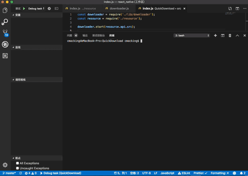

# QuickDownload

`通过 URL 抓取内容(HTML/API-JSON)快速下载自定义的资源`
Quickly download images from the remote

### 支持情况
- 自定义配置
- 深度抓取模式
- 自动多级目录
- 正向代理池（待开发）
- 队列多线程任务（待开发）

## Install

[Install NodeJS and suggest >= 8.11.0](https://nodejs.org/zh-cn/)

## Usage

- API Config [配置项](./src/resource/url/api.js)
```Node
src:[{
  // 其它节点需按此格式进行配置
  // 检索的远程端地址
  url: '',
  // 是否启用(非必须)
  enable: true,
  // 深度爬取级别(非必须，不建议超过3级)
  depth: 1
}]
```

- Run
```bash
npm start
```

### 演示


-------------------

`禁止商业用途 ❤ 研究学习范畴 ❤ 作者保留解释权`
Commercial use is forbidden and The author reserves the right of interpretion

[✶ MIT ✶](./LICENSE)